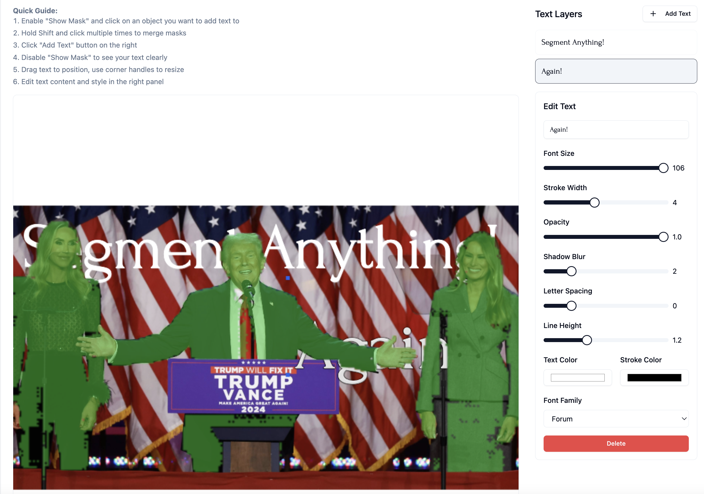

# Text Overlay for SAM2 Segmentation
This is a Next.js application that extends [geronimi73/next-sam](https://github.com/geronimi73/next-sam) project by adding text overlay capabilities to the segmented images. The base project performs image segmentation using Meta's Segment Anything Model V2 (SAM2) and onnxruntime-web.

> 🚀 Try it now: [text-behind-six.vercel.app](https://text-behind-six.vercel.app/)

> 💡 Everything runs directly in your browser - no backend required! All processing, including AI segmentation and text manipulation, happens on your device.


> 👋 I'm super interested in your forks and progress with this project! Feel free to reach out on [X/Twitter](https://x.com/hormold) to share your work.

> 🎯 This project was created using Vibe Coding - a new way of programming with Claude Sonnet + Cursor IDE. Read more about Vibe Coding in [Andrej Karpathy's thread](https://x.com/karpathy/status/1886192184808149383). Be gentle with the code - it's an experiment in AI-assisted development! 🤖✨

# New Features
* Text overlay on segmented objects
* Multiple text layers with individual styling
* Rich text customization:
  * Font family selection (10+ web fonts)
  * Font size and stroke width
  * Text and stroke colors
  * Opacity control
  * Letter spacing and line height
  * Text shadow effects
* Interactive text manipulation:
  * Drag & drop positioning
  * Corner handles for resizing
  * Multiple text layers management
* Export options:
  * PNG with transparency
  * JPEG with white background
  * Original mask export



# Original Features (from next-sam)
* Utilizes [Meta's SAM2 model](https://ai.meta.com/blog/segment-anything-2/) for segmentation
* [onnxruntime-web](https://github.com/microsoft/onnxruntime) for model inference
* webgpu-accelerated if GPU available and supported by browser, cpu if not
* Model storage using [OPFS](https://developer.mozilla.org/en-US/docs/Web/API/File_System_API/Origin_private_file_system)
* Image upload or load from URL
* Mask decoding based on point prompt (positive and negative points)
* Tested on macOS with Edge (webgpu, cpu), Chrome (webgpu, cpu), Firefox (cpu only), Safari (cpu only)

# Installation
Clone the repository:

```bash
git clone https://github.com/Hormold/text-behind
cd text-behind
pnpm install
pnpm run dev
```

Open your browser and visit http://localhost:3000 

# Usage
1. Upload an image or load from URL
2. Click the "Encode image" button to start encoding
3. Enable "Show Mask" and click on an object you want to add text to
4. Hold Shift and click multiple times to merge masks
5. Click "Add Text" button on the right
6. Disable "Show Mask" to see your text clearly
7. Drag text to position, use corner handles to resize
8. Edit text content and style in the right panel
9. Export as PNG/JPEG or export the mask only

# Acknowledgements
* Original project by [geronimi73/next-sam](https://github.com/geronimi73/next-sam)
* [Meta's Segment Anything Model 2](https://ai.meta.com/blog/segment-anything-2/)
* [@raedle](https://github.com/raedle) for adding [positive/negative clicks](https://github.com/geronimi73/next-sam/pull/1)
* [onnxruntime](https://github.com/microsoft/onnxruntime)
* [Shadcn/ui components](https://ui.shadcn.com/)
* [transformer.js](https://github.com/huggingface/transformers.js)

# License
MIT License - see LICENSE file for details
